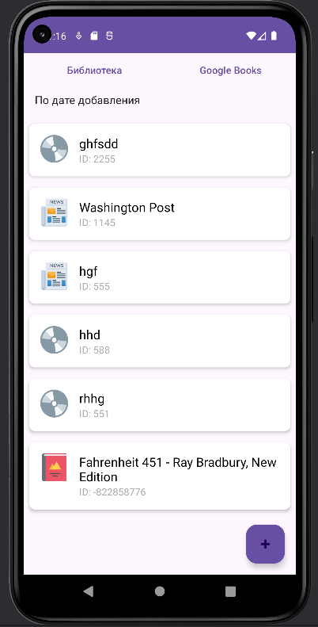
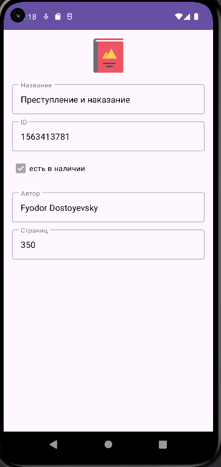
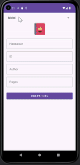
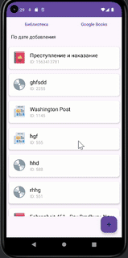
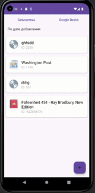

# Library Manager

**Library Manager** — учебное Android-приложение для управления библиотечным фондом. Позволяет добавлять, просматривать, искать и редактировать книги, газеты и диски с возможностью локального хранения и поиска книг онлайн через Google Books API.

## 🚀 Основные возможности

- Хранение данных о книгах, газетах и дисках в локальной базе данных Room.
- Добавление, удаление и редактирование элементов библиотеки.
- Поиск книг по названию и автору онлайн через Google Books API.
- Сортировка списка по названию и дате добавления.
- Просмотр подробной информации о каждом элементе.
- Двухпанельный режим для планшетов/ландшафтной ориентации.
- Современный архитектурный стек (MVVM, Dagger, Room, Retrofit).

## 🏗️ Структура проекта

```plaintext
app/
├── data/          # Источники данных (Room, Retrofit), репозитории
├── domain/        # UseCase и бизнес-логика, сущности
├── presentation/  # UI-фрагменты, ViewModel-ы, DI-компоненты
└── res/           # Ресурсы (иконки, макеты, строки и др.)
```

## ⚙️ Технологии

- **Kotlin** (основной язык)
- **AndroidX**, **Material Components**
- **MVVM**
- **Room** (локальная БД)
- **Retrofit** + **kotlinx.serialization** (Google Books API)
- **Dagger2** (DI)
- **ViewBinding**
- **Navigation Component**
- **Glide** (загрузка изображений)
- **Shimmer** (заглушка при загрузке)

## 📱 Основные экраны

- Список библиотеки (книги/газеты/диски)
- Детальная информация об элементе
- Добавление/редактирование книги, газеты или диска
- Поиск онлайн по Google Books

## 📸 Скриншоты

<div align="center">
  
  
  
  
  
</div>

## 🛠️ Архитектура

- Чистая архитектура: слои `data`/`domain`/`presentation`
- DI через Dagger
- Room с миграциями для локального хранения данных  
